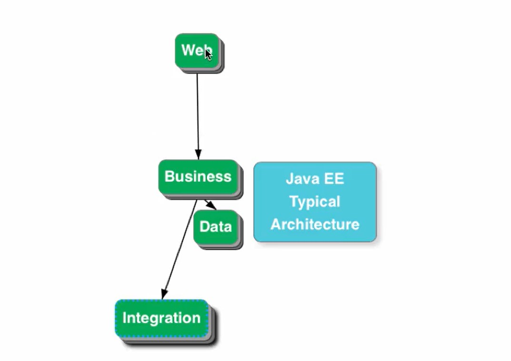

Typically, any web application will have following 4 layers:  

### Web Layer
 
- once we have biz logic we can expose web services or as web application onscreen. So it exposes biz logic to outside world. V(View) and
  C(controller) of MVC is in Web Layer.
-  Servlet/JSP very basic way of developing web applications but no more used today. 
-  Common MVC framework - Struts, Spring MVC
-  Common View: Velocity, JSF, Angular, JSP, 
  
###  Business Layer
- All business logic here, talk to integration layer, data layer etc. 

###  Data Layer
- To talk to database
- M(Model) of MVC 

###  Integration Layer
- to talk to another application. So it helps integrate with other systems

###  Model2 Architecture: 

1. From Browser request is coming to Front Controller. In Spring MVC this Front Controller is called dispatcher servlet  
2. DispatcherServlet will do mapping. /login is mapped to LoginController#sayHello method.  
3. Once it get mapped, it will return response which is "Hello World"  
4. Once dispatcherServlet gets response "Hello World" it starts looking for view.  
5. to prevent it from looking for view and rather just ask dispatcherServlet to return whatever we are passing, we have used another annotation which
   is @ResponseBody
6. This will return whatever method is returning directly to browser.  
7. Later we will see how to redirect it to JSP or another view resolver.

Thus, we have single point of control
 

