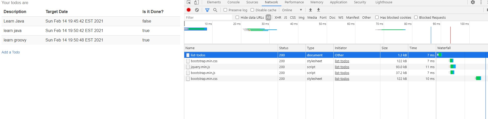

- Added following dependenccy 

```xml
         <dependency>
            <groupId>org.glassfish.web</groupId>
            <artifactId>jakarta.servlet.jsp.jstl</artifactId>
            <version>1.2.6</version>
        </dependency>
```

- Now using jstl (Java Standard Tag Library) we can do for loop over list of todos and display list in each row of table as follows:

Added following uri
```
<%@ taglib uri="http://java.sun.com/jsp/jstl/core" prefix="c"%>
```

-  Now we can add for loop over list of todos and display them in table format

```xml
	
		<table>
			<caption>Your todos are</caption>
			<thead>
				<tr>
					<th>Description</th>
					<th>Target Date</th>
					<th>Is it Done?</th>
				</tr>
			</thead>
			<tbody>
				<c:forEach items="${todos}" var="todo">
					<tr>
						<td>${todo.desc}</td>
						<td>${todo.targetDate}</td>
						<td>${todo.done}</td>
					</tr>
				</c:forEach>
			</tbody>
		</table>

 
```

## Next What we will do:
- Add bootstrap to give basic formatting to the page : We use bootstrap classes container,table and table-striped.
- We will use webjars
 
- bootstrap is just css framework which helps us to format stuff in very very easy way
```
Already auto configured by Spring Boot : o.s.w.s.handler.SimpleUrlHandlerMapping : Mapped URL path [/webjars/**] onto handler of type
[class org.springframework.web.servlet.resource.ResourceHttpRequestHandler]
```

```xml
       <dependency>
            <groupId>org.webjars</groupId>
            <artifactId>bootstrap</artifactId>
            <version>3.3.6</version>
        </dependency>
        <dependency>
            <groupId>org.webjars</groupId>
            <artifactId>jquery</artifactId>
            <version>1.9.1</version>
        </dependency>
```

it should be added just above html body end. 
```
<script src="webjars/jquery/1.9.1/jquery.min.js"></script>
	    <script src="webjars/bootstrap/3.3.6/js/bootstrap.min.js"></script>
		<link href="webjars/bootstrap/3.3.6/css/bootstrap.min.css" rel="stylesheet">
	    		
```

#### How this flow works:



- Request goes to dispatcher and dispatcher comes back with html
- Response contains HTML and link to jquery.min.cs and bootstrap.min.cs etc. 
- Dispatcher comes back and says I need these js and css files. Browser creates additonal requests for these. 
- 200 status means its successfully done 

- Further, bootstrap provide div class to format the table furthe. 

```
<div class="container">
<table class="table table-striped">

</table>
 <div> <a class="button" href="/add-todo">Add a Todo</a></div>
```